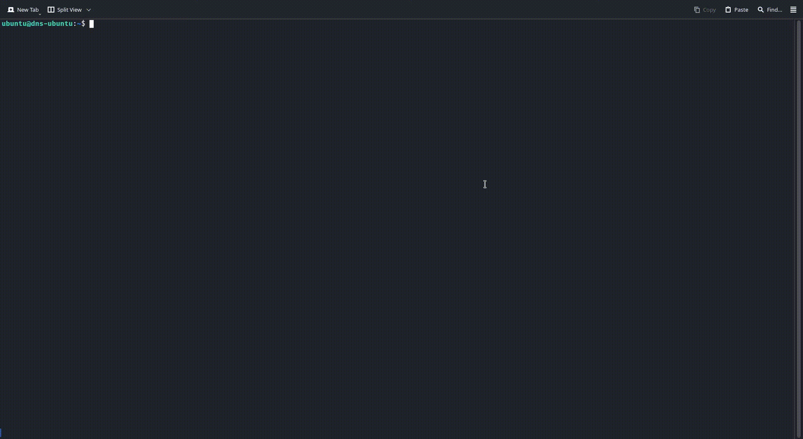

# DNS Resolver on VM

A DNS resolver built with BIND9 on a virtual machine (Ubuntu Server) for LAN.

## Features
- Caching DNS resolver using BIND9.
- Custom local domain (`mylan.local`) with sample records.
- Restricted to LAN queries for security.
- Logging all queries.

## Setup Instructions
1. Create a VM with Ubuntu Server in VirtualBox.
2. Set a static IP (e.g., `192.168.0.110`).
3. Install BIND9: `sudo apt install bind9 bind9utils dnsutils`.
4. Configure BIND9 (see `configs/`).
5. Test with: `dig @192.168.0.110 google.com` or `dig @192.168.0.110 www.mylan.local`.

## Files
- `configs/01-netcfg.yaml`: Netplan config for static IP.
- `configs/named.conf.options`: BIND9 main config.
- `configs/named.conf.local`: Local zone config.
- `configs/db.mylan.local`: Zone file for `mylan.local`.

## File Locations
- `/etc/netplan/01-netcfg.yaml`: Netplan config file.
- `/etc/bind`: BIND9 default directory for its config (i.e. main config, zone, zone config) files.
- `/var/log/named/query.log`: Log file. If not present create one.

## Usage
Set LAN devices DNS to the VM’s IP (e.g., `192.168.0.110`).
Or, set LAN WiFi Router or APs DNS to VM's IP, so it will get shared with DHCP.

- To watch live DNS queries hitting the server, use the command `watch` with colors for better visibility:
- `watch -n 2 "tail -n 10 /var/log/named/query.log | sed -E \"s/^([0-9]{2}-[A-Za-z]{3}-[0-9]{4} [0-9]{2}:[0-9]{2}:[0-9]{2}\.[0-9]{3})/\x1b[33m\1\x1b[0m/g; s/([0-9]{1,3}(\.[0-9]{1,3}){3})#([0-9]+)/\x1b[32m\1\x1b[0m#\3/g; s/\(([a-z0-9.-]+\.[a-z]+)\)/\x1b[34m(\1)\x1b[0m/g; s/query: ([a-z0-9.-]+\.[a-z]+)/query: \x1b[34m\1\x1b[0m/g\""`

- Add a alias for the watch command to .bashrc for bash or .zshrc for zsh:
- `alias watchbind='watch -n 2 "tail -n 10 /var/log/named/query.log | sed -E \"s/^([0-9]{2}-[A-Za-z]{3}-[0-9]{4} [0-9]{2}:[0-9]{2}:[0-9]{2}\.[0-9]{3})/\x1b[33m\1\x1b[0m/g; s/([0-9]{1,3}(\.[0-9]{1,3}){3})#([0-9]+)/\x1b[32m\1\x1b[0m#\3/g; s/\(([a-z0-9.-]+\.[a-z]+)\)/\x1b[34m(\1)\x1b[0m/g; s/query: ([a-z0-9.-]+\.[a-z]+)/query: \x1b[34m\1\x1b[0m/g\""'`

- Now run `watchbind` and watch live queries.
- Demo Video:

